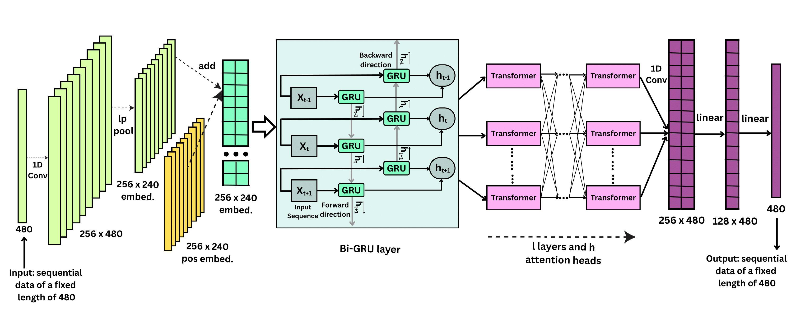

# GRU-BERT-for-NILM
This repository contains the implementation of GRU-BERT models for Non-Intrusive Load Monitoring (NILM), as presented in our published work. The models leverage a combination of  GRU layers and BERT-based embeddings to accurately predict household appliance energy consumption and ON/OFF states from aggregated smart meter readings.

# Datasets
The UK Domestic Appliance-Level ELECTRIcity [(UK-DALE)](https://arxiv.org/abs/1404.0284) dataset provides detailed energy usage data from five UK households, including both aggregate mains and individual appliance readings. We use low-frequency data for five appliances namely, refrigerator, washer-dryer, microwave, dishwasher, and kettle. All signals are resampled to six-second intervals with forward-filling applied for gaps under three minutes, ensuring temporal alignment between mains and appliance-level data.
The Reference Energy Disaggregation Dataset [(REDD)](https://github.com/inesylla/energy-disaggregation-DL) is a benchmark NILM dataset widely used for evaluating appliance-level energy disaggregation. For the REDD dataset, we use the pre-processed data where thresholds and parameters are chosen based on experimental settings.

# Training Process
Run the following command to train the model. Dataset, the name of the appliance and number of epochs should be given as input. The hyperparameters can be tuned my modifying the utils.py file. 

`python train.py`

# Model Architecture
In this work, we propose a novel improved hybrid deep learning NILM approach based on GRU and BERT, which performs per-appliance prediction of both the power consumption and ON/OFF status of individual appliances. We develop two models that separately combine BERT with unidirectional and bidirectional variants of GRU. Our proposed model is illustrated as follows: 

# Performance
